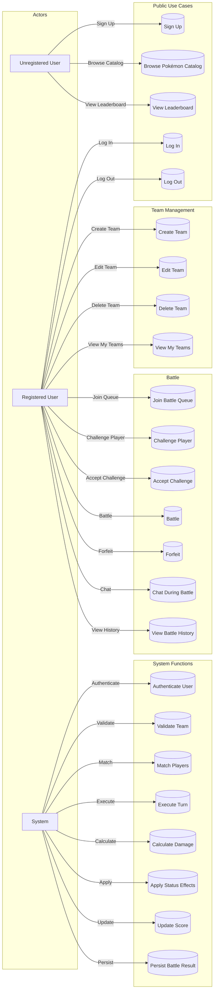

# Pokémon Rivalry


Web-based Pokémon battle simulator inspired by [Pokémon Showdown](https://pokemonshowdown.com). Build competitive teams, battle other players in real-time via WebSockets, and climb the global leaderboard.

---

## Table of Contents

- [Features](#features)
- [Tech Stack](#tech-stack)
- [Use Cases](#use-cases)
- [Quick Start](#quick-start)
- [Documentation](#documentation)
- [Project Structure](#project-structure)
- [Database](#database)

---

## Features

- **User Authentication** — Sign up, log in, and session management with JWT (httpOnly cookies)
- **Team Builder** — Create up to 6 teams with full EV/IV customization, natures, abilities, items, and movesets
- **Real-time Battles** — WebSocket-based matchmaking, turn-based combat with full battle engine
- **Battle Engine** — Damage formula (Gen V+), 18-type effectiveness matrix, STAB, critical hits, status conditions, stat stages, and move effects
- **Leaderboard** — Global ranking by score
- **Pokémon Catalog** — Browse all Pokémon species, moves, items, abilities, natures, and types
- **Responsive UI** — Vanilla JavaScript frontend with Pokémon sprites, type icons, and animated GIFs

---

## Tech Stack

| Layer           | Technology                                      |
|----------------|-------------------------------------------------|
| **Backend**     | Python 3.11+ · FastAPI · Uvicorn · Gunicorn    |
| **Database**    | MariaDB 10.6+ · SQLAlchemy 2.0 (async + automap) |
| **Auth**        | JWT (python-jose) · bcrypt                      |
| **Realtime**    | WebSockets (FastAPI/Starlette)                  |
| **Rate Limit**  | slowapi                                         |
| **Frontend**    | Vanilla JavaScript · CSS3 · Jinja2 Templates    |
| **Assets**      | Font Awesome 7.2.0 · Inter Font · Veekun Sprites |
| **Data Source** | [Veekun](https://veekun.com) Pokémon dataset     |

---

## Use Cases


---

## Quick Start

### Prerequisites

- Python 3.11+
- MariaDB 10.6+
- Git

### Setup

```bash
# Clone the repository
git clone https://github.com/sebastian8068/pokemon_rivalry.git
cd pokemon_rivalry

# Create and activate virtual environment
python -m venv venv
source venv/bin/activate  # Linux/Mac
# venv\Scripts\activate   # Windows

# Install dependencies
pip install -r requirements.txt

# Create database and import schema
mysql -u root -p < database/schema/dump-PokemonRivalry-202607120248.sql

# Populate database (choose one)
python database/scripts/fill_all_db/load_cli.py   # Full Veekun data
# or
python database/scripts/fill_partially_db/load_cli.py  # Partial CLI data

# Configure environment
cp .env.example .env  # Edit with your database credentials

# Run the server
python run.py
```

Open `http://localhost:8080` in your browser.

---

## Documentation

All documentation is available in the [`docs/`](docs/) directory:

| File                 | Description                        |
|----------------------|------------------------------------|
| [SETUP.md](SETUP.md) | Detailed installation guide        |
| [ARCHITECTURE.md](ARCHITECTURE.md) | System architecture overview |
| [API.md](API.md)     | REST & WebSocket API reference     |
| [BATTLE_ENGINE.md](BATTLE_ENGINE.md) | Battle mechanics & damage formula |
| [TEAM_BUILDER.md](TEAM_BUILDER.md) | Team building rules & validation  |
| [DEPLOYMENT.md](DEPLOYMENT.md) | Production deployment guide        |
| [DATABASE.md](DATABASE.md) | Database schema & ER diagram       |
| [CONTRIBUTING.md](CONTRIBUTING.md) | How to contribute                 |

---

## Project Structure

```
pokemon_rivalry/
├── run.py                          # Entry point
├── requirements.txt                # Python dependencies
├── src/
│   ├── main.py                     # FastAPI app
│   ├── controller/                 # Route handlers
│   │   ├── login/                  # Authentication endpoints
│   │   ├── pages.py                # Page routes
│   │   ├── team.py                 # Team CRUD + catalog
│   │   ├── battle.py               # Battle history
│   │   └── ws_manager.py           # WebSocket manager
│   ├── game_engine/                # Battle engine
│   │   ├── pokemon.py              # BattlePokemon class
│   │   ├── damage.py               # Damage calculation
│   │   ├── effects.py              # Move effects
│   │   ├── moves.py                # Move registry
│   │   ├── stat_calculator.py      # Stat computation
│   │   ├── type_effectiveness.py   # Type matrix
│   │   └── enums.py                # Enumerations
│   ├── model/                      # Data access layer
│   │   ├── base.py                 # SQLAlchemy automap
│   │   ├── database.py             # Async engine
│   │   └── login/                  # Auth service & schemas
│   └── view/                       # Frontend assets
│       ├── templates/              # Jinja2 templates
│       ├── battle/ home/ login/ team/  # HTML, CSS, JS
│       └── sprites/                # Pokémon, items, types
├── database/                       # DB scripts & schema
│   ├── schema/                     # SQL dump
│   └── scripts/                    # Data population
└── tests/                          # Test suite
```

---

## Database

14 tables power the application. See [DATABASE.md](DATABASE.md) for the full ER diagram and schema documentation.

**Core tables:** `User`, `Team`, `Team_member`, `Pokemon`, `Move`, `Ability`, `Item`, `Nature`, `Type`

**Junction tables:** `Ability_pokemon`, `Move_pokemon`, `Type_pokemon`

---

## License

Proprietary. All rights reserved.
